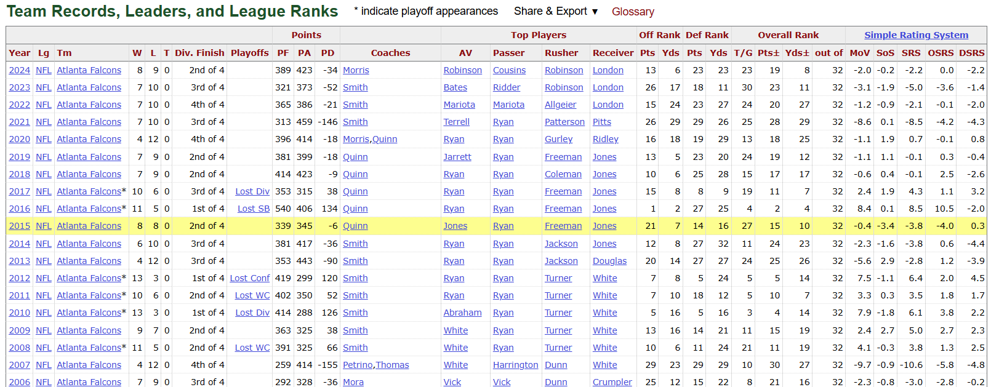

# Pro Football Reference API [www.pro-football-reference.com/]
Go api servicing GET requests for Pro Football Reference tables.
<br/>
<br/>
<b>DNS Address </b>
```
BASE_URL=ec2-18-118-33-121.us-east-2.compute.amazonaws.com
```
<b>Functioning Request Routes</b> ( see [handlers](https://github.com/BREISAMU/pro-football-reference-api/tree/main/handlers) for further documentation ):
<br/>
- $BASE_URL/team?team=TEAM_NAME&year=YEAR
- $BASE_URL/draft?team=TEAM_NAME&year=YEAR

## Example usage   

```
curl "ec2-18-118-33-121.us-east-2.compute.amazonaws.com/team?team=atl/year=2015"
```
<br/> -->
<br/><br/>
```
{
    "year": 2015,
    "league": "NFL",
    "team": "Atlanta Falcons",
    "wins": 8,
    "losses": 8,
    "ties": 0,
    "divisionFinish": 2,
    "playoffExitRound": 0,
    "pointsFor": 339,
    "pointsAgainst": 345,
    "pointsDif": -6,
    "headCoaches": "Quinn",
    "bestPlayerAv": "Jones",
    "bestPlayerPasser": "Ryan",
    "bestPlayerRusher": "Freeman",
    "bestPlayerReceiver": "Jones",
    "offRankPts": 21,
    "offRankYds": 7,
    "defRankPts": 14,
    "defRankYds": 16,
    "takeawayRank": 27,
    "pointsDifRank": 15,
    "yardsDifRank": 10,
    "teamsInLeague": 32,
    "marginOfVictory": -0.4,
    "strengthOfSchedule": -3.4,
    "srs": -3.8,
    "offensiveSrs": -4,
    "defensiveSrs": 0.3
}
```

#
(https://www.pro-football-reference.com/)
